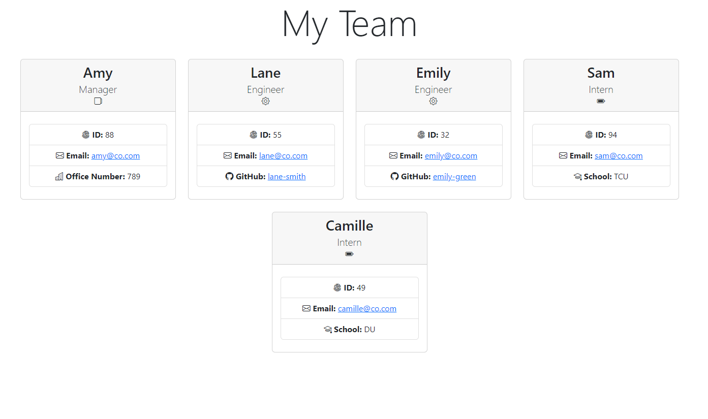

# Team Profile Generator
  

## Description

This application is built using `Node.js` and `npm inquirer pkg` that takes in information(from the terminal) about employees on a software engineering team and generates an HTML webpage that displays summaries for each person. This app is written entirely in Javascript, using Bootstrap and template literals that will render and create a sophisticated Team Profile page in a html format.

## Table of Contents

  - [Description](#description)
  - [Table of Contents](#table-of-contents)
  - [Installation](#installation)
  - [Usage](#usage)
  - [License](#license)
  - [How to Contribute](#how-to-contribute)
  - [Tests](#tests)
  - [Questions](#questions)
    - [Walkthrough Demonstration](#walkthrough-demonstration)
  - [Mockup](#mockup)

## Installation

To install this application, you will need to clone the repo and install the inquirer module by entering `npm install inquirer` into the command-line.

>_If you want to learn more about the inquirer pkg, [click here](https://www.npmjs.com/package/inquirer)._

## Usage

This app runs directly through the command-line by entering  `node index.js`  or `node` followed by the main filename. You will be given a variety of prompts that will create a webpage with the data you entered in the terminal. The stylized exmaple.html file will appear in the root directory after the user chooses 'No my team is finished.'

## License

This project is licensed under **MIT** license.

## How to Contribute

When creating an open source project on GitHub, there is always the option for other developers to contribute to your projects. | If you would like to contribute, please contact me at the email listed below.

## Tests

There are written tests that validate the object classes and constructor methods within the Employee.js, Manager.js, Engineer.js and Intern.js files. These test are run by using the npm Jest package; Open the terminal and make sure you are running these in the ./test directory, then enter: `npm run test`.

>_If you want to learn more about the Jest testing pkg, [click here](https://jestjs.io/)._

## Questions

Please reach out with any questions you may have about this application.

* :octocat: GitHub: [@lindsey-lansford](https://github.com/lindsey-lansford)
* :envelope: Email: [lindsey.lansford@gmail.com](mailto:lindsey.lansford@gmail.com)

---
### Walkthrough Demonstration

[Watch the Video](https://drive.google.com/file/d/1T6ccxPS2zWLY2nIovMsIgV3aMkqM6AHg/view?usp=sharing)

## Mockup

Here is an example screenshot of a page generated by the application.

